学习笔记

一、数组、链表、跳表

1. 理论学习

   跳表 (skip list)

   ​	思想：以空间换时间

   ​	条件：元素有序

   ​	特点：对标平衡树和二分查找，插入/删除/搜索 时间复杂度是O(logn)，空间复杂度是O(n)

   ​	e.g. 

   ​	(1)添加第一级索引 ->next+1，相当于原始链表一次走2步

   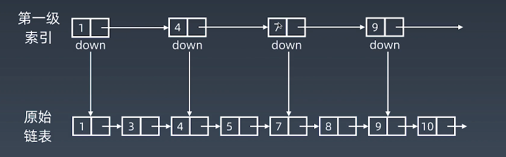

   ​	(2)检索8

   .png)

   ​    (3)添加第二级索引，基于第一级索引next+1，相当于原始链表一次走4步

   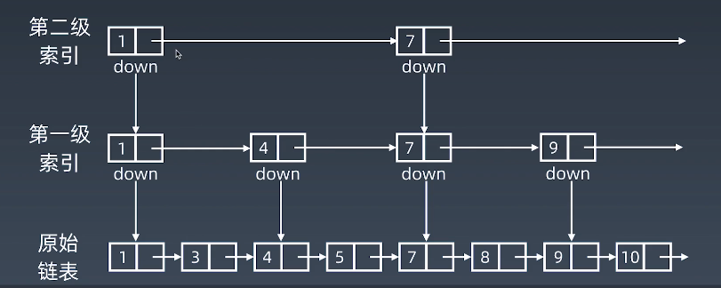

   ​	(4)检索8

   .png)

2. 数组习题

   【1】移动零

   ​	（1）思路

   ​			交换非零元素；双指针；滚雪球

   ​	（2）代码

   ​		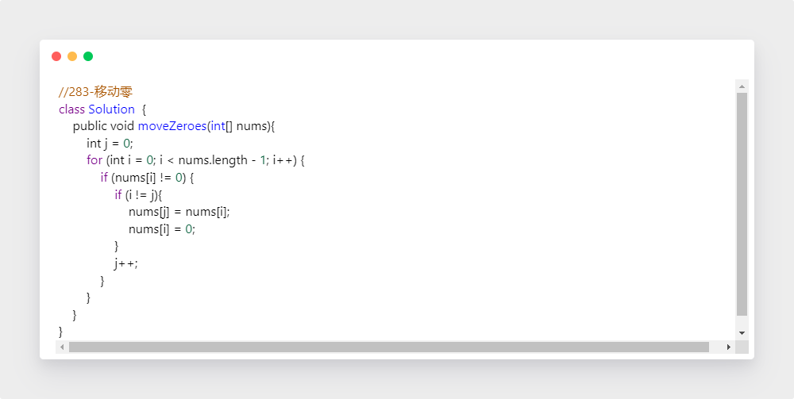

   【2】盛水最多的容器

   （1）思路

   ​			双指针，左右夹逼

   （2）代码

   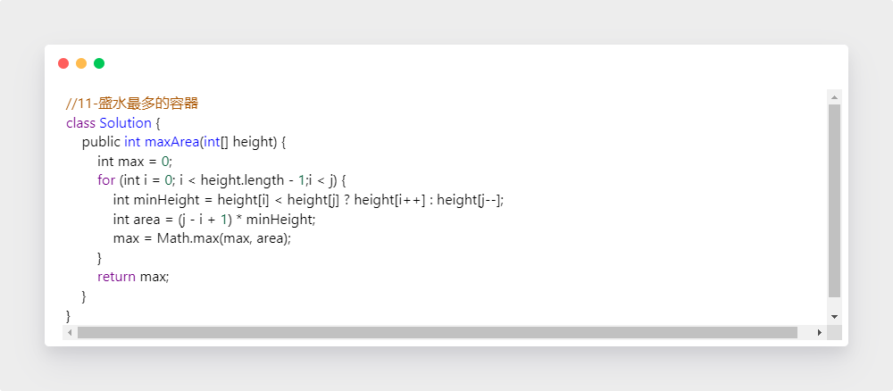

   【3】爬楼梯

   （1）思路

   ​		Fibonacci 迭代

   （2）代码

   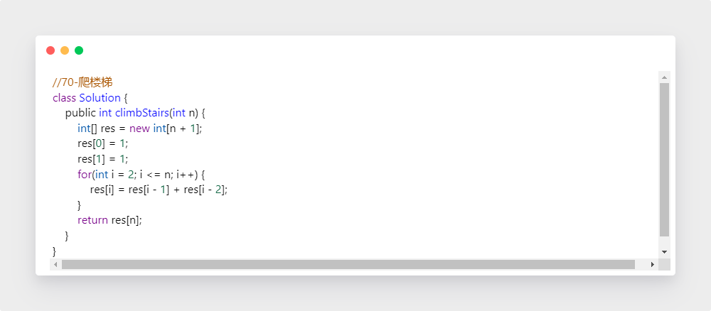

   【4】两数之和

   （1）思路

   ​	暴力；一遍哈希表，检测是否存在target - a

   （2）代码

   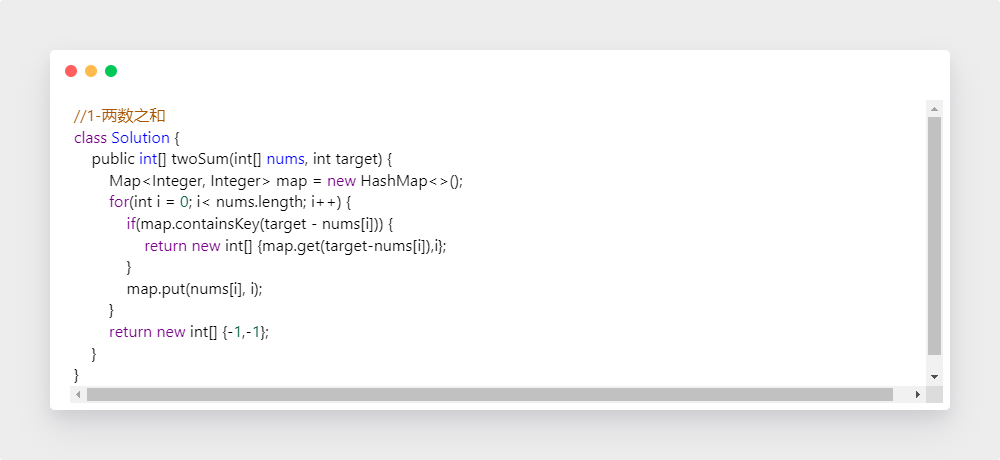

   【5】三数之和

   （1）思路

   ​	暴力；哈希表 -c

   （2）代码

   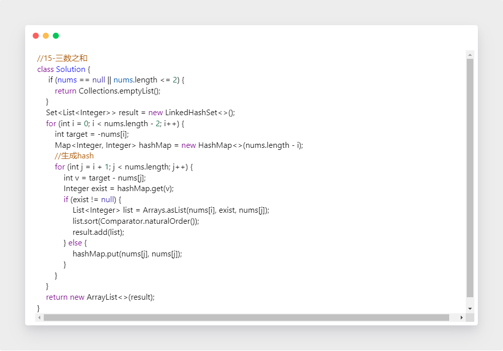

3. 链表习题

   【1】反转链表

   （1）思路

   ​		对于每一个结点，保存下一位置，将后继指向前驱，再处理下一结点

   （2）代码

   · 双指针解法

   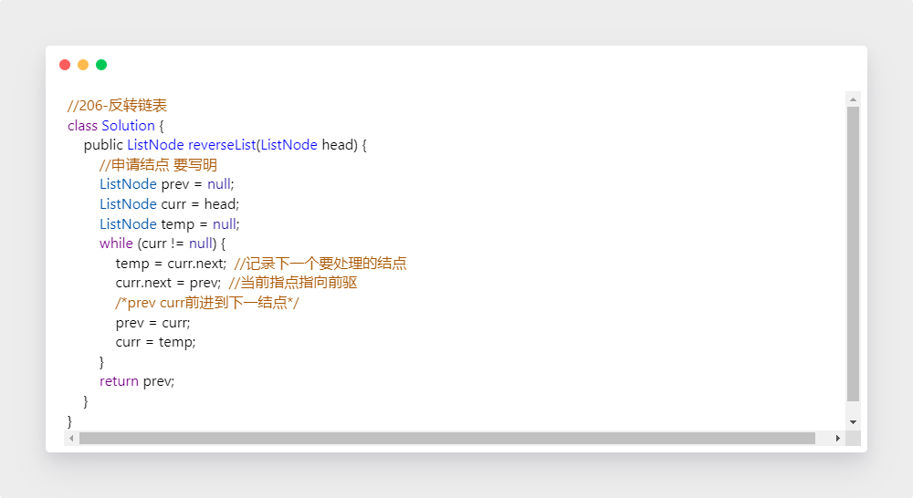

   · 递归解法

   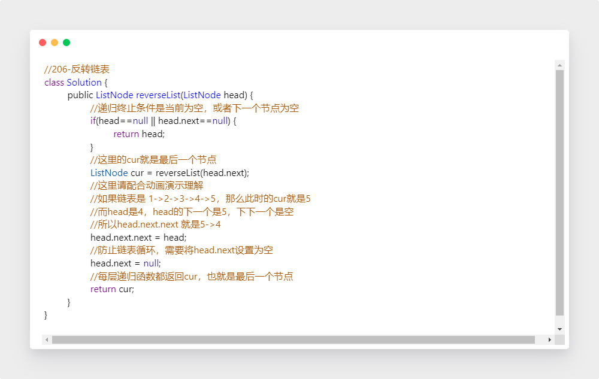

   【2】两两交换结点

   （1）思路

   ​		first 连接后面交换完成的子链表，second 连接 first，完成交换

   （2）代码

   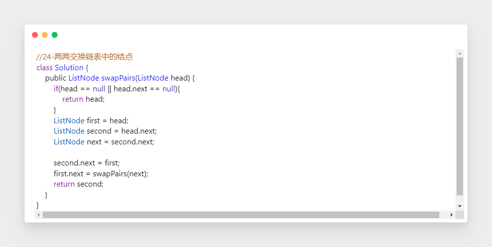

   【3】环形链表

   （1）思路

   ​		快慢指针，慢指针每次只移动一步，而快指针每次移动两步，如果快指针套圈与慢指针相遇，则说明有环

   （2）代码

   ​	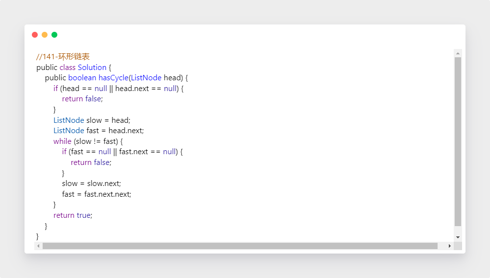

   【4】环形链表II

   （1）思路

   ​	快慢指针，构造两次相遇

   （2）代码

   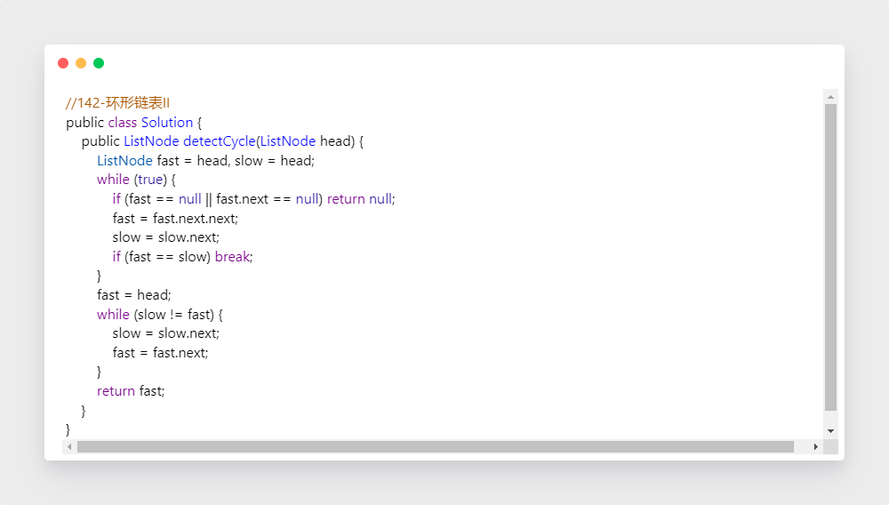

   【5】K个一组翻转链表

   // 还是没太透彻，有时间再弄

   （1）思路

   ​		  可以递归，也可以用栈

   （2）代码

      · 递归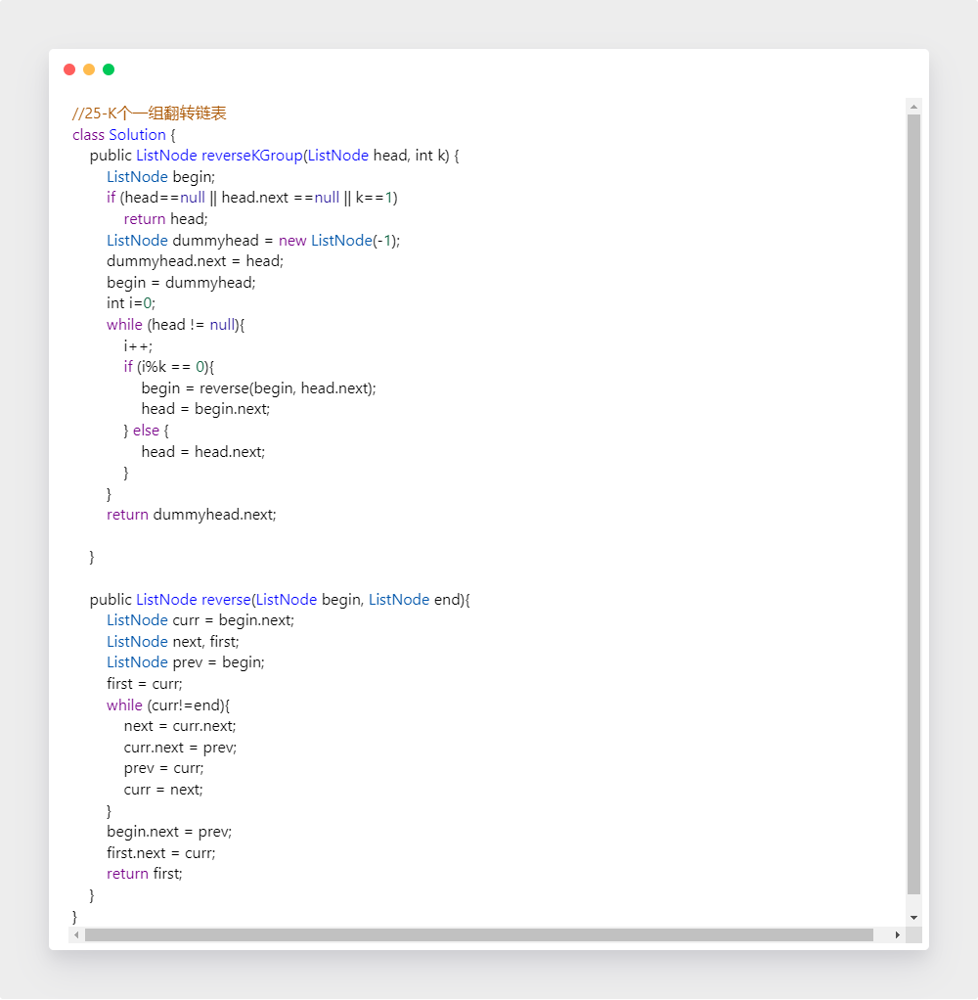

二、栈、队列、优先队列、双端队列

  1. 理论学习

     自己查询系统接口的方法

三、哈希表、映射、集合

1. 理论学习

2. hash习题

   【1】有效的字母异位词

   （1）思路

   ​		养成clarification习惯，和面试官明确什么是异位词，以及是否区分大小写,etc.

   ​		排序；字符计数

   （2）代码

   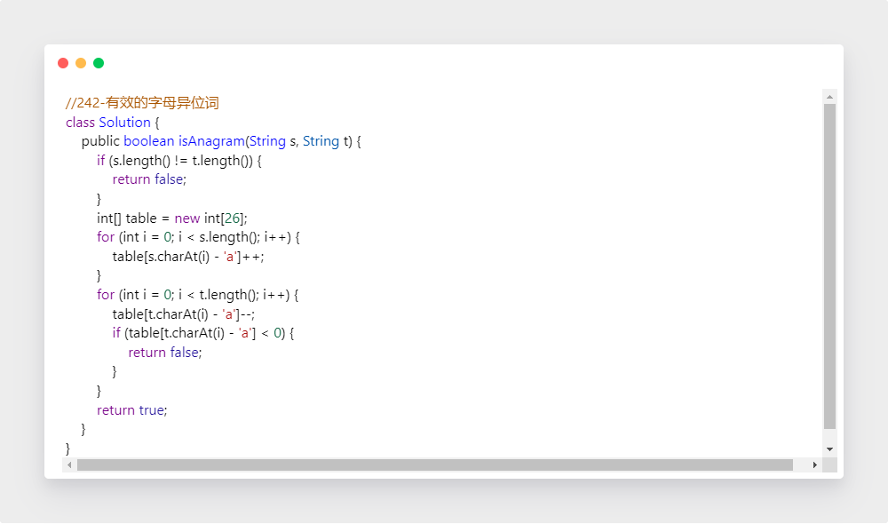

   【2】字母异位词分组

   （1）思路

   ​		排序；字符计数

   （2）代码

   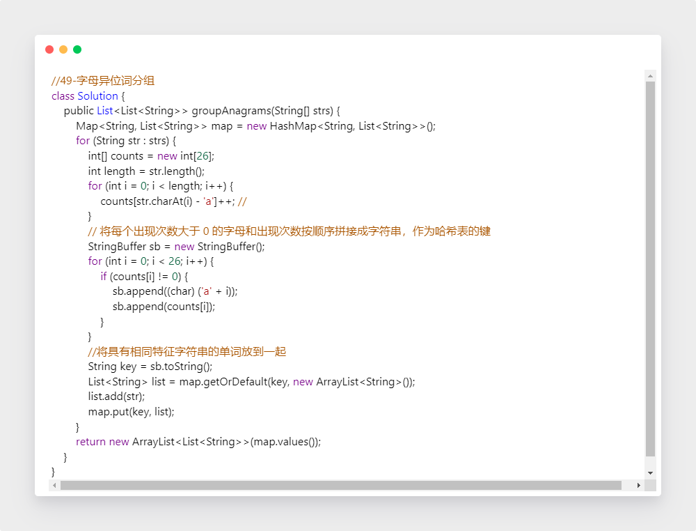

四、作业总结

​	见提交的代码

五、本周思维导图

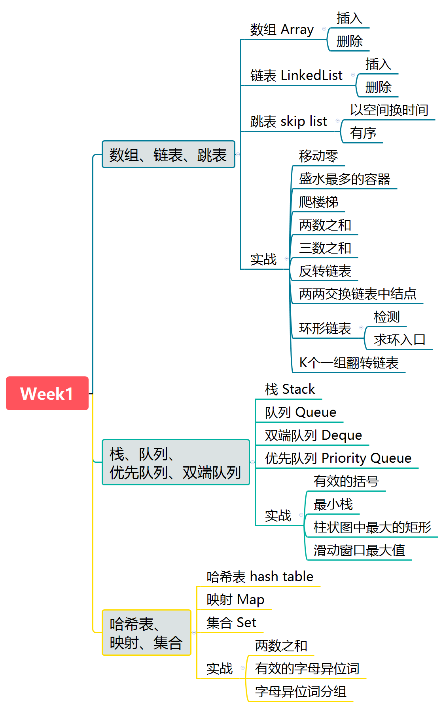