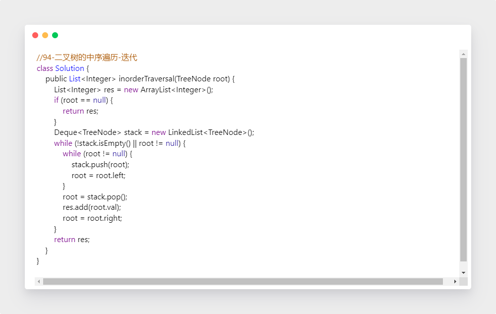
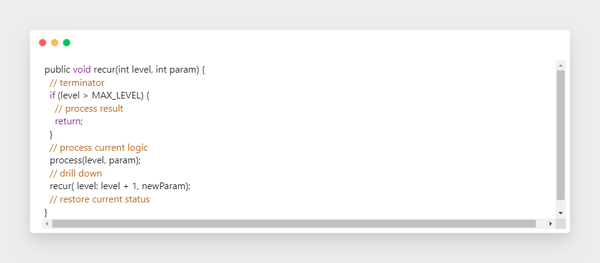

学习笔记

一、树、二叉树、二叉搜索树

1. 理论学习

   （1）维度提升，LinkedList是特殊化的Tree，Tree是特殊化的Graph

   （2）二叉树的遍历

   ​		先序遍历：根-左-右

   ​		中序遍历：左-根-右

   ​		后序遍历：左-右-根

   （3）二叉搜索树：左 < 根，右 > 根，以此类推

   ​		性质：中序遍历是升序

   ​		查询、插入、删除操作，要有印象，过程详见visualgo

2. 实战题目

    树的遍历相关操作，当做模板熟记

   有时间可以了解一下Morris方法和颜色标记法

   【1】二叉树的前序遍历

   （1）思路

   另构造一个实现遍历的方法，按根-左-右操作，再调用之

   （2）代码

   ·递归

   

   ·迭代

   

   之后的思路都差不多，只是具体操作顺序不同，除非特殊情况，否则不再赘述

   【2】二叉树的中序遍历

   ·递归

   

   ·迭代

   

   【3】二叉树的后序遍历

   （1）思路
   		除常规做法 左-右-根，老老实实写，还有一种基于先序遍历的方法

   ​		先序遍历：中-左-右 ==> 中-右-左，之后再reverse，即可得到 左-右-根

   （2）代码

   ·递归

   ​	

   ·迭代

   

   ·基于先序遍历

   

   【4】N叉树的前序遍历

   （1）思路

   ​	和二叉树的不同点在于，不只有左右两个儿子，所以用for循环取出所有

   ​	显然N叉树无中序遍历，效果都一样的

   （2）代码

   ​	

   【5】N叉树的后序遍历

   

   【6】N叉树的层序遍历

   （1）思路

   ​	可以拓展一下思路到DFS、BFS相关了

   （2）代码

   

   

二、堆和二叉堆、图

1. 理论学习

   （1）堆：可以迅速找到一堆数中的最大或最小值的数据结构，只能实现最大或最小一种操作

   （2）实现比较

   ①二叉堆只是最简单的一种实现，效率一般

   ②Fibonacci堆实际效果较好

   ③Java用种Priority Queue实现，默认为小根堆，重写Comparator可以实现大根堆

   

   （3）二叉堆的实现

   ​	①底层是数组，位置可以通过索引确定

   ​	②插入：新元素插到堆的尾部（数组的最后一个位置），再依次向上调整整个堆 HeapifyUp()

   ​	③删除：将堆尾元素替换到顶部，依次向下调整整个堆 HeapifyDown()

   (4) 图

   ​	①DFS

   ​	②BFS

   ​	③连通性

   ​	④最短路

   ​    ⑤拓扑排序

   ​	⑥最小生成树

2. 实战题目 

   【1】最小的K个数

   （1）思路

     暴力；自己维护大根堆；使用Priority Queue

     感觉所有涉及到堆的题，大体操作可以分为两个阶段：

   ​	① 静态构成：在个数（k个）限制前，创建堆

   ​	②动态维护：比较大小，不断替换根（max or min），直到结束

   （2）代码

   ​	

   【2】滑动窗口的最大值

   （1）思路

   共用k-1个元素，，窗口右移，只有1个元素变化

   （2）代码

   

   【3】丑数II

   丑数的判断，采用了暴力，而其延伸考虑使用小根堆

   （1）思路

   （2）代码

   

   【4】前K个高频元素

   统计频次，再使用小根堆

   

三、递归

1. 理论学习

   （1）递归的效率不一定就不高

   （2）避免人肉递归

   （3）找到最近最简方法，拆解成可重复性问题

   （4）数学归纳

   （5）递归代码模板

   

2. 实战题目

   【1】爬楼梯：Fibonacci的递归解法

   【2】括号生成

   （1）思路

    2n个格子，先产生所有再排除；边生成，边判断

   （2）代码

   

   【3】翻转二叉树

   （1）思路

   递归，自顶向下或自底向上都可以

   （2）代码

   【4】验证二叉搜索树

   （1）思路

   ①验证中序遍历是否为递增序列：遍历后统一比较；边遍历，边比较；利用最大值和最小值比较

   ②递归：按照定义

   （2）代码

   

   

   【5】二叉树的最大深度

   （1）思路

   左右子树的最大深度+1

   （2）代码

   

   【6】二叉树的最小深度

   （1）思路

   左右子树的最小深度+1

   （2）代码

   

   【7】二叉树的序列化与反序列化

   （1）思路

   ​	DFS 序列化和反序列化一定要采用相同的遍历方式，如同时采用先序遍历

   ​	BFS 层次遍历

   （2）代码

   

   

四、作业总结

见提交的代码

排列组合问题涉及回溯的思想，目前看起来比较痛苦，下周再努力攻克一下

五、本周思维导图

