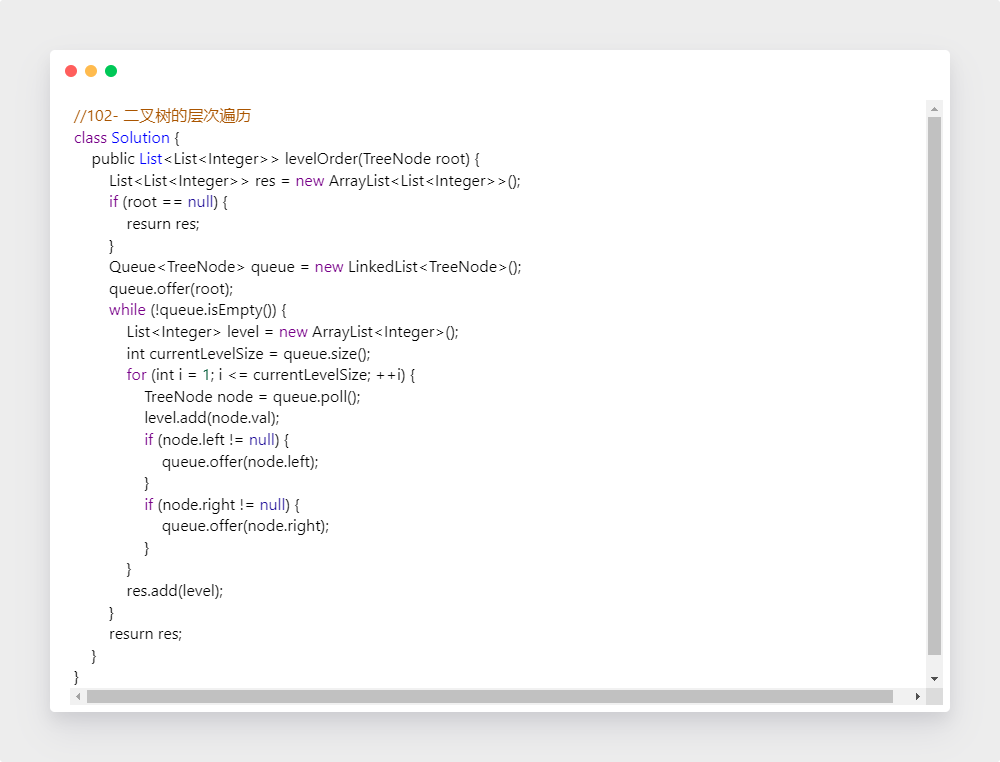
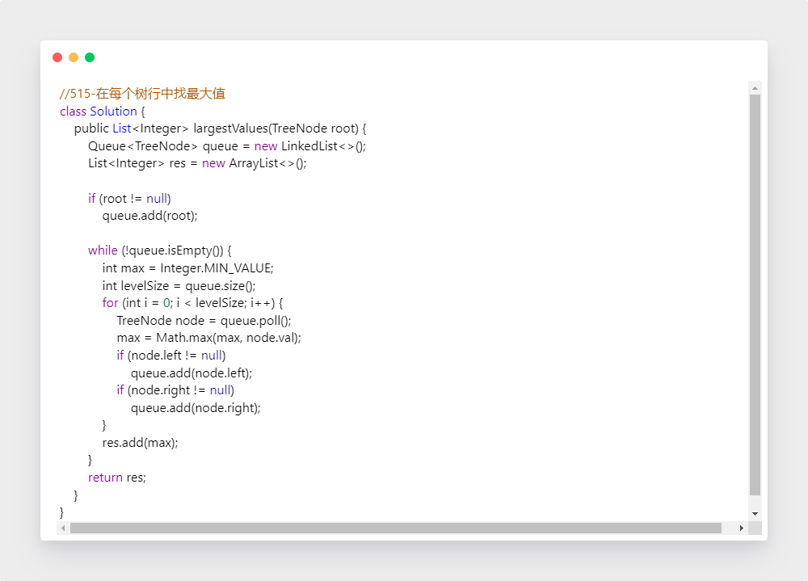

学习笔记

一、分治、回溯
	1.理论学习

​    （1）递归和回溯是递归的细分类

​	（2）核心在于找到重复性

​	（3）分治是处理是分—治—合，和普通递归的区别就在于最后一步的合并子结果；同时，子问题的拆分和中间子结果的质量如何保证是重点

​	（4）分治处理模板

​	2.实战题目

​	【1】Pow(x,n)

​		（1）思路

​			2^10  = 2^5 * 2^5

​            2^5 = 2^2 * 2^2   

​			根据奇偶判断是否需要再补一个

​		（2）代码

.png)

​	【2】子集

​		（1）思路

​			每个元素取或不取

​		（2）代码

 【3】多数元素

​	（1）思路

​			暴力：统计频数；排序；

​			分治；投票法（开心消消乐）

​    （2）代码

​		· 分治

​		· 投票法

 【4】电话号码的字母组合

​	（1）思路

​			回溯，先生成<数字,字母>哈希表，每取一个数字，将其对应的所有字母插入到已生成的组合，然后继续处理下一位数字。不存在可以舍弃，进而剪枝优化的情况

​            国际站也有用队列进行拼接的方法

​	（2）代码

 【5】N皇后问题

​	（1）思路

​			回溯，一列一列放，检查左上、正上、右上是否满足条件，落定之后，继续向下处理，完成当前所有可能情况后，恢复状态

​    （2）代码

二、DFS、BFS

​	1.理论学习

​		（1）搜索方式分类

​				①暴力搜索，就是朴素地遍历所有结点

​				②深度优先

​				③广度优先

​				④优先级优先，启发式搜索

​		（2）一定要使用visited集合提高效率，避免走重复结点

​		（3）DFS模板

​		（4）BFS模板

​	2.实战题目

​		【1】二叉树的层序遍历

​		（1）思路

​				BFS，根元素入队，当队列不为空，将不为空的左右子树加入队列，进行搜索

​    	（2）代码

​		【2】最小基因变化

​		（1）思路

​			BFS，把start放入队列中，出队一个元素，修改这个元素上第一字母， 四个字母都遍历一遍，如果和最后一个元素匹配，那么就退出，返回当前的step；如果修改后元素的在bank中出现，那么就放入队列中，同时删除bank中的相同的元素。然后把第一个元素还原原先的字母，然后开始修改第二个字母。执行和第2步一致

​		可以使用双向BFS优化，所有起点和终点都已知的搜索过程，都可以用双向BFS来优化

​    	（2）代码

​		【3】括号生成

​		（1）思路

​			回溯，通过左括号的数量进行剪枝

​    	（2）代码

​		【4】在每个树行中找最大值	

​		（1）思路

​			BFS DFS均可

​    	（2）代码

三、贪心算法

​	1.理论学习

​		（1）每一步都选取当前状态下最好的选择，局部最优->全局最优

​		（2）使用情景：问题能够分为子问题来解决，子问题的最优解最终能递推到最终问题的最优解

​		（3）贪心 vs 动态规划：动态规划保存以前的运算结果，可以回退

​	2.实战题目（作业）

​	【1】买卖股票的最佳时机II

​		（1）思路

​			贪心，只要第二天涨了，我就买，买完挣钱了就卖，保证只赚不亏

​    	（2）代码

​	【2】分发饼干

​		（1）思路

​			贪心，选择可以满足这个孩子的胃口且尺寸最小的饼干

​    	（2）代码

​	【3】跳跃游戏

​		（1）思路

​				贪心，从前向后，每次跳最远，看最远能到哪；从后向前，则反之

​	    （2）代码

四、二分查找

​	1.理论学习

​		（1）使用条件：

​			①单调

​			②有上下界

​			③index访问

​		（2）模板

​		

​	2.实战题目

​		当回答面试官，此题可以用二分查找时，最好先说清其符合使用条件，即单调性、上下界、下标访问

​		【1】x的平方根

​			（1）思路

​				二分查找；牛顿迭代

​    		（2）代码

​				· 二分查找

​    	  · 牛顿迭代

​		【2】有效的完全平方数

​			（1）思路

​				二分查找，同上

   		 （2）代码

​		【3】搜索旋转排序数组

​			（1）思路

​    		（2）代码

五、本周思维导图

