学习笔记

一、动态规划

 1. 理论学习

    （1）动态规划和递归或者分治没有根本上的区别，关键在于有无最优子结构

    （2）共性：找到重复子问题

    （3）差异性：最优子结构，中途可以淘汰次优解，即只需缓存最优的子问题解

    （4）解题三部曲：①最优子结构②储存中间状态③建立DP方程

 2. 例题及实战题目

    【1】Fibonacci数列

    ​		思路：傻递归 ==> 递归 + 记忆化搜索 [自顶向下] ==> 一维数组动态递推 [自底向上]
    
    【2】不同路径
    
    ​	（1）思路：二维Fibonacci ==> 一步能到达的范围 A/B -> End [自顶向下]==> End -> A / B [自底向上] 
    
     状态定义：dp[i] [j] 经过此点到达目的点的路径数 
    
     DP方程：dp[i]] [j] = dp[i-1] [j] + dp[i] [j-1]
    
    ​	（2）代码
    
    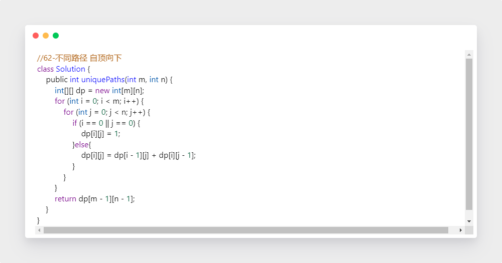
    
    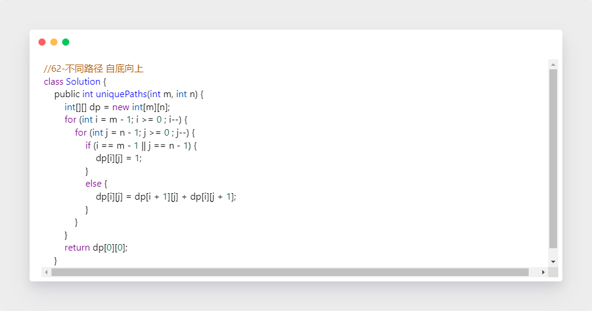
    
    【3】不同路径II
    
    ​	（1）思路
    
    ​			在有障碍的情况下，障碍点的方法数为0，其余和上一题一致
    
    ​	（2）代码
    
    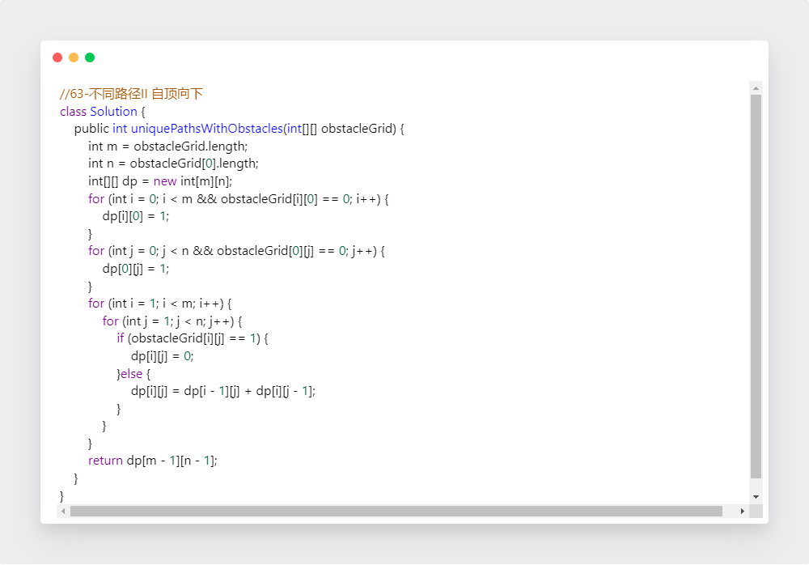
    
    【4】最长公共子序列
    
      （1）思路
    
    ​		①暴力：参考子集，取或不取，生成所有子序列，与另一串比对
    
    ​		②动态规划：
    
    ​		状态定义：dp[m] [n] 表示：text1[0...m] 和 text2[0...n] 的最长公共子序列的长度
    
    ​		DP方程：末端相同 ==> dp[i] [j] = dp[i-1] [j-1] + 1;
    
    ​                         末端不同 ==> dp[i] [j] = Math.max(dp[i-1] [j], dp[i] [j-1]);
    
    ​	【总结】字符串总结经验：采用二维数组，分别位于行列
    
    （2）代码
    
    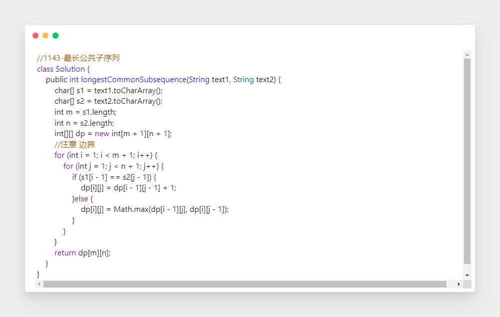
    
    【5】三角形路径的最小路径和
    
    ​	 （1）思路 自顶向下和自底向上均可
    
    ​         状态定义 dp[i] [j] ：点(i,j) 到底边的最小路径和
    
      	   DP方程：dp[i] [j] += Math.min(dp[i + 1] [j], dp[i + 1] [j + 1]) + 该点的权值 triangle.get(i).get(j);
    
    ​		【空间优化】只需用到前面一行的路径和 O(N^2) ---> O(n)
    
    ​        【总结】空间优化角度：二维数组 ==> 一维数组 ==> 变量迭代 / 复用原来的空间 / 滚动数组
    
    ​     （2）代码
    
    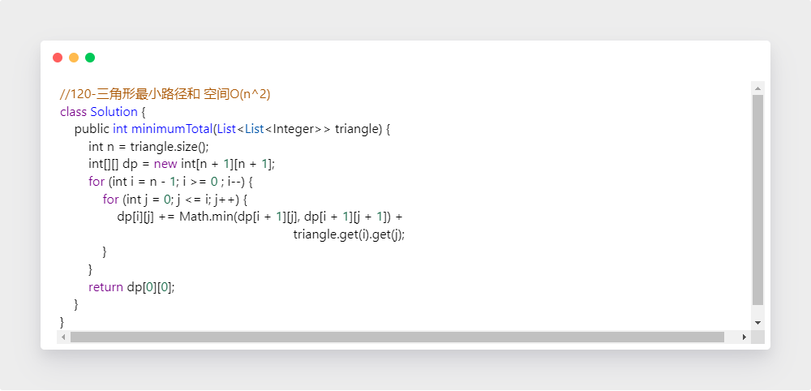
    
    
    
    【6】最大子序和
    
    ​	（1）思路
    
    ​		暴力、分治、动态规划
    
    ​        状态定义：dp[i] : 当前元素自身最大（如果之前是负，就从当前另起一个子序列） / 包含之前的元素后加自身最大
    
    ​	    DP方程：dp[i] = max(dp[i - 1], 0) + a[i] 
    
    ​	（2）代码
    
    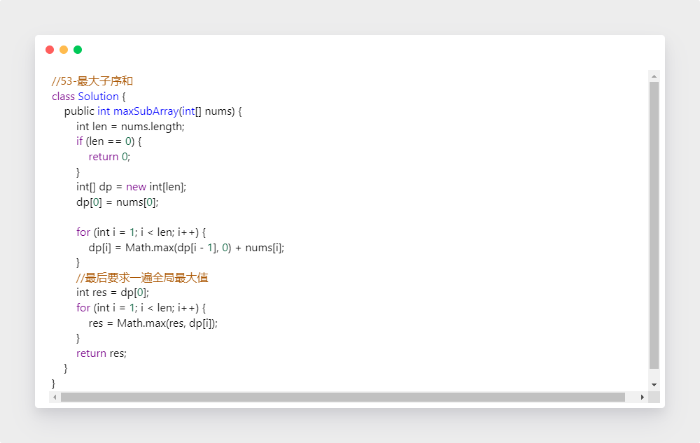
    
    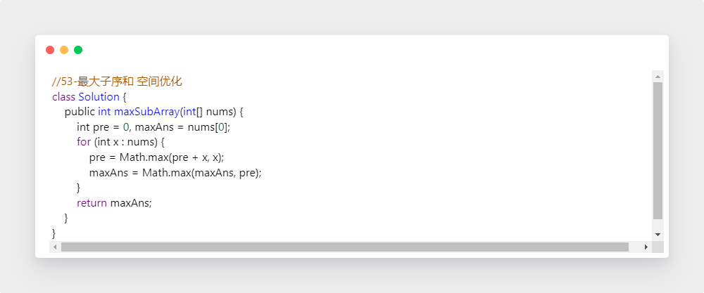
    
    【7】乘积最大数组
    
    ​	（1）思路
    
    ​			大体上与上题相同，但需要注意：
    
    ​            负值不能舍去，可能最后负负得正， 所以保留绝对值最大的负值和 最大的正值，最后比较
    
    ​	（2）代码
    
    ​			具体处理上可以分别处理三种状态，或者单独针对负数处理
    
    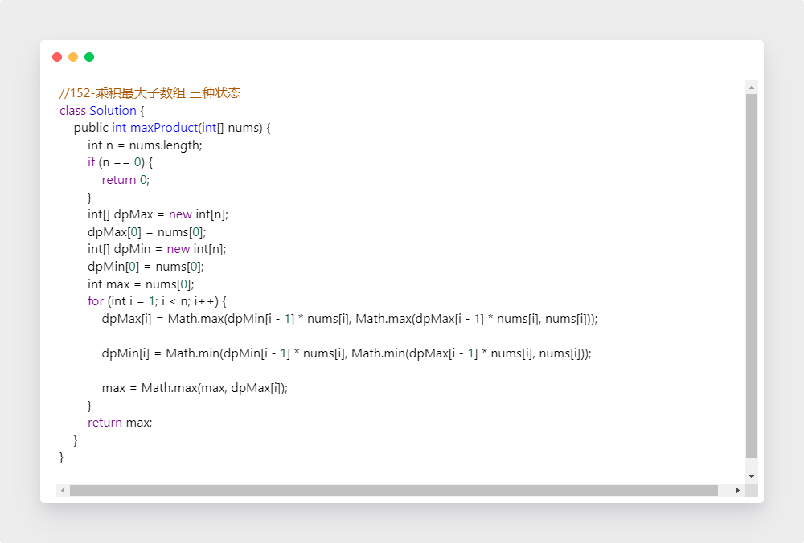
    
    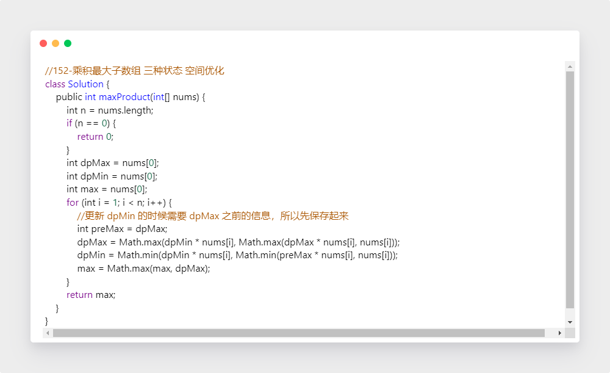
    
    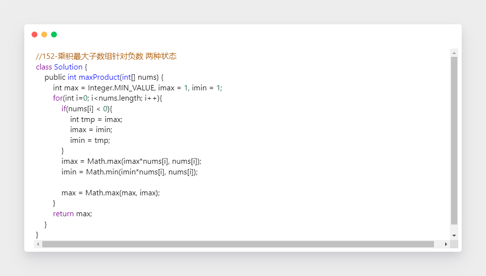
    
    【8】零钱兑换
    
    ​	（1）思路
    
    ​		构建状态树，树的层次为硬币数，BFS 找到层次最小的数值为0的结点
    
    ​		动态规划：
    
    ​			状态定义：f(n) 最少硬币个数
    
    ​			DP方程：f(n) = min(f(n-k)) k in coins[] +1
    
    ​	（2）代码
    
    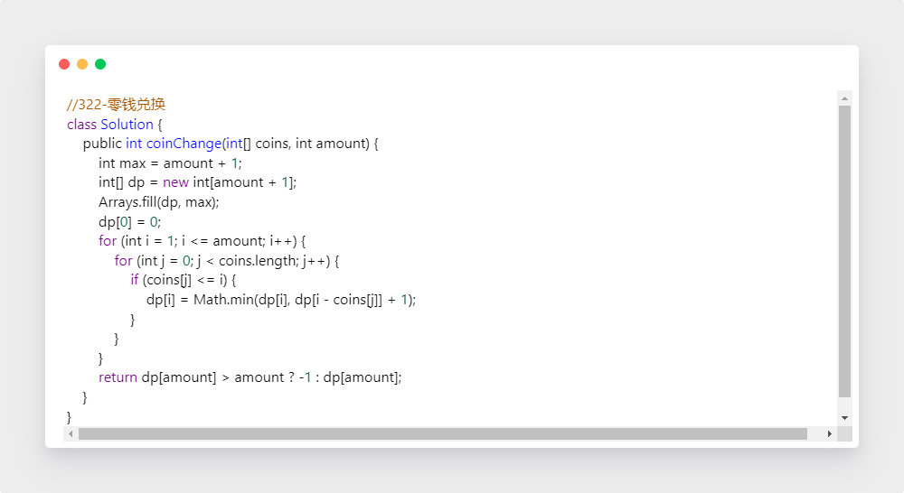
    
    【9】打家劫舍
    
    ​	（1）思路
    
    ​		①采用二维数组，进行状态确认
    
    ​			状态定义：a[i] [0,1] 能偷到的 max value；0-不偷，1-偷
    
    ​	        DP方程：a[i] [0] = max{a[i-1] [0], a[i-1] [1]}     ； a[i] [1] = a[i-1] [0] + nums[i]
    
    ​	   ② 状态化简
    
    ​		   状态定义：a[i] 能偷到的 max value, 无论第i个房子偷或不偷, 所有情况下的最大值
    
    ​            DP方程：a[i] = max(a[i-1], num[i] +a[i-2])    解释：确定偷第i个， i-1不能偷，从i-2, i-3,i-4....选一个，而i-2 包含i-3 的情况，故a[i-2] > a[i-3]. 且从公式本身也可看出 a[i] > a[i-1]
    
    ​	（2）代码
    
    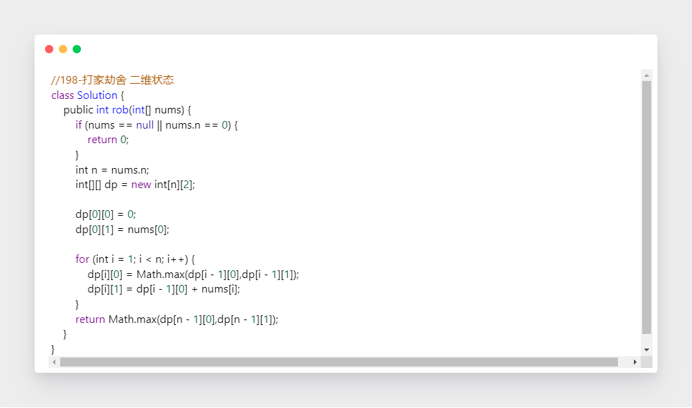
    
    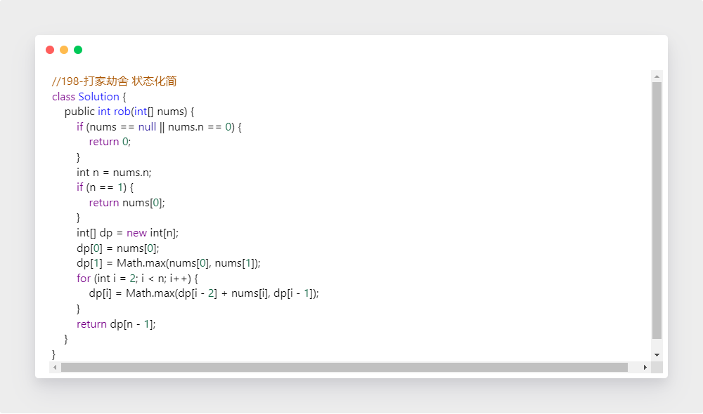
    
    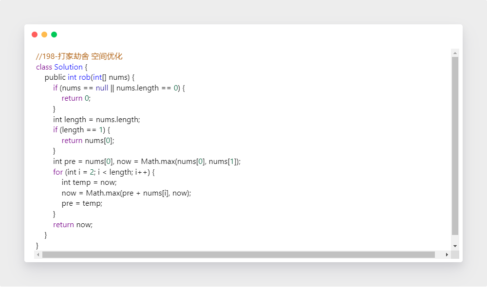
    
    【10】打家劫舍II
    
    ​	（1）思路
    
    ​			大体上和上题思路一致，将环形队列分别按头尾拆成两部分，分别做两次，最后取max
    
    ​	（2）代码
    
    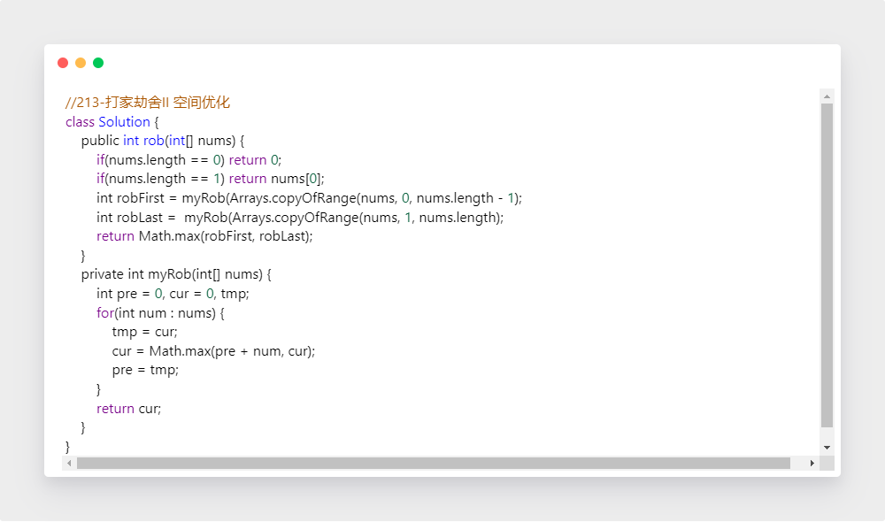

二、本周导图

​		 	感觉自己之前做的脑图太简略了，不是能很好的串联起来，请教助教大大，具体应该如何用思维导图来整理，或者有没有同学做的好的，可以给指个路，谢谢！！

三、期中总结

过年了，没搞完，后续补上

