学习笔记

一、字典树

1. 理论学习

   首先回顾了树、二叉树、二叉搜索树的结构

   【核心思想】空间换时间（一层至少是26叉的），利用字符串的公共前缀来降低查询时间的开销，以达到提高效率的目的

   【基本性质】

   【1】字典树是多叉树，根据字符进行分叉

   【2】结点本身不存储完整的单词，从根结点到某一结点的路径，表示某一单词

   【3】每个结点的所有子节点路径代表的字符都不相同

   【4】可以额外存储词频

   【应用】词频统计，前缀感应

   【内部实现】

   【1】指针：用相应的字符指向下一结点，叶子结点指向null

   【2】26叉树（ENG） 255叉（ASCII）

   【3】 有几个字符，就查询几次

   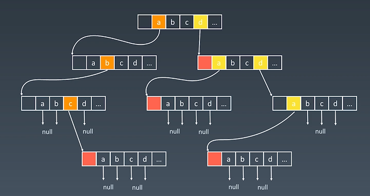

2. 实战题目

   【1】实现Trie树

    （1）思路

   ​		①构造结点

   ​		isEnd 属性表示 当前结点是否为某个字符串的最后一个字符

   ​		next[] 存储和它关联的所有子结点

   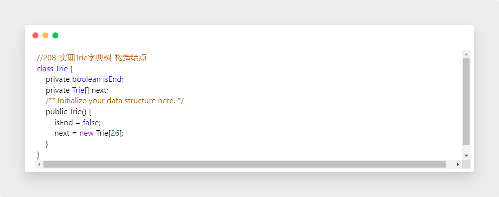

      	② 插入

   ​		从根结点开始查找，检查当前结点中与插入字符的对应关系：

   ​		如果匹配，继续移动到该路径中的下一个节点，并继续比对下一个字符；

   ​		如果不匹配，创建一个新的结点，并将它与父结点的链接相连，该链接与当前的键字符相匹配；

   ​		重复以上步骤，直到到达键的最后一个字符，然后将当前节点标记为结束节点，算法完成。

   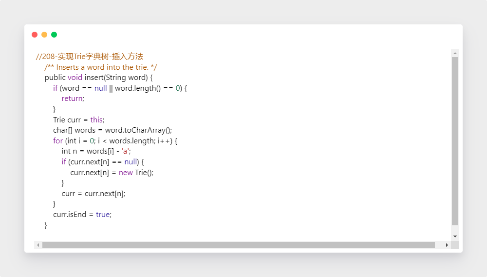

    	   ③查找

   ​		从根结点的子结点开始，一直向下匹配即可：

   ​		如果出现结点值为空就返回 false；

   ​		如果一直匹配到了最后一个字符，为了避免是某个词的前缀，所以还需判断当前结点是否是终止结点即 isEnd == true

   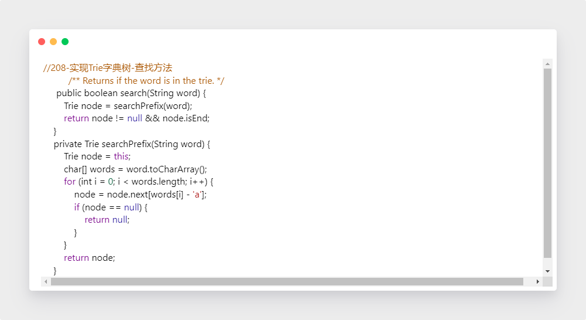

   ​		④查找前缀

   ​		和查找方法大体上一致，只是最后不必判断isEnd

   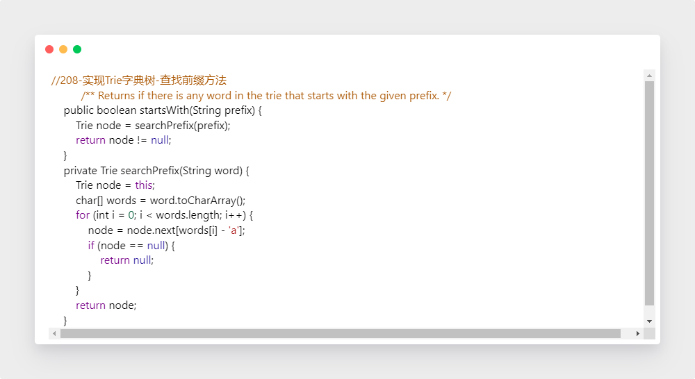

    （2）代码

   ​		完整代码

   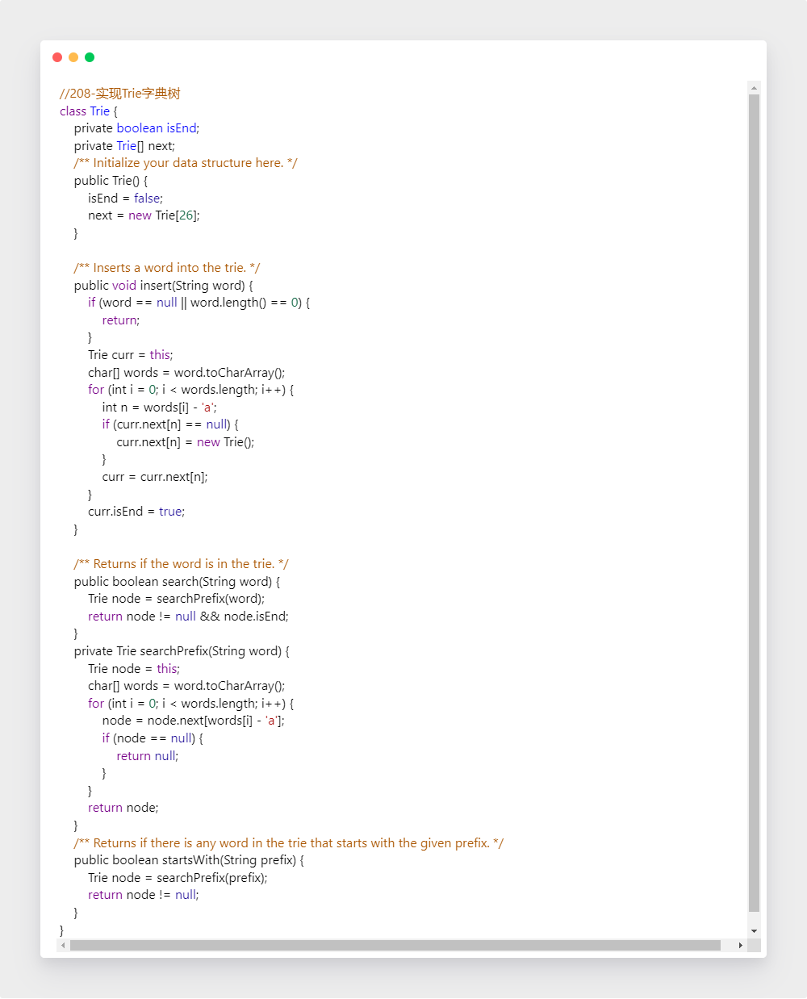

   【2】单词搜索II

    （1）思路

   ​	根据words中的单词构建一个字典树；
   ​    从每个单元格开始，如果字典中存在以单元格中的字母开头的单词，则我们开始回溯探索，探索当前单元格周围的相邻单元格，以进行下一个递归调用。在每次搜索时，我们都会检查到目前为止遍历的字母序列是否与字典中的任何单词匹配

    （2）代码

   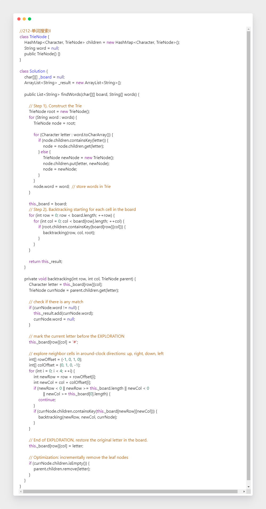

二、并查集

1. 理论学习

   【并查集的基本操作】

   【1】建立：建立一个新的并查集

   【2】合并：把两个元素所在的集合合并，如果两元素相交则不合并

   【3】查找：找到元素所在集合的代表元素

   【并查集的数据结构】

   【1】每个结点维护一个parent数组

   【2】初始化

   

   【3】查找代表元素

   ​	看一个元素的parent，直到parent等于他自己 parent[i] = i

   【4】合并

   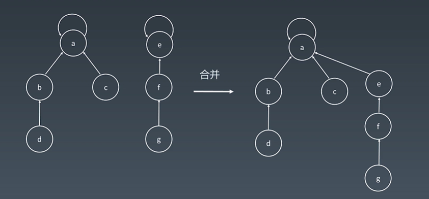

   【5】路径压缩

   【应用】组团配对问题，涉及两个群组的关系，以及快速合并

   e.g. 最后有几个组？某一个元素属于谁？任意两个元素是否属于一个组？

   

   并查集模板

   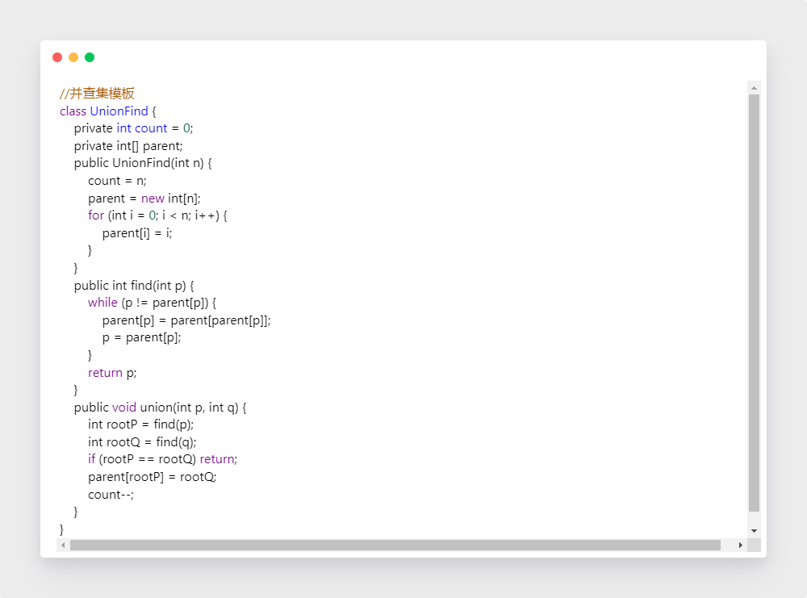

2. 实战题目

    	DFS和BFS也都可以实现，这里只记录采用并查集的思路

   ​	【1】省份数量（朋友圈）

    	（1）思路

   ​			初始时，每个城市都属于不同的连通分量，各自为集合代表元素

   ​			遍历矩阵，如果两个城市之间相连，进行合并

   ​		    遍历完成后，计算连通分量的总数，即为省份的总数

    	（2）代码

   ​		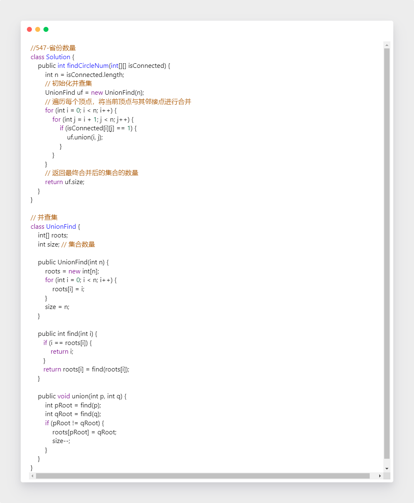

   ​	【2】岛屿数量

    	（1）思路

   ​		相邻的陆地（只需要向右看和向下看）合并，只要发生过合并，岛屿的数量就减少 1；
   ​		在遍历的过程中，同时记录空地的数量；
   ​		并查集中连通分量的个数 - 空地的个数，就是岛屿数量

    	（2）代码

   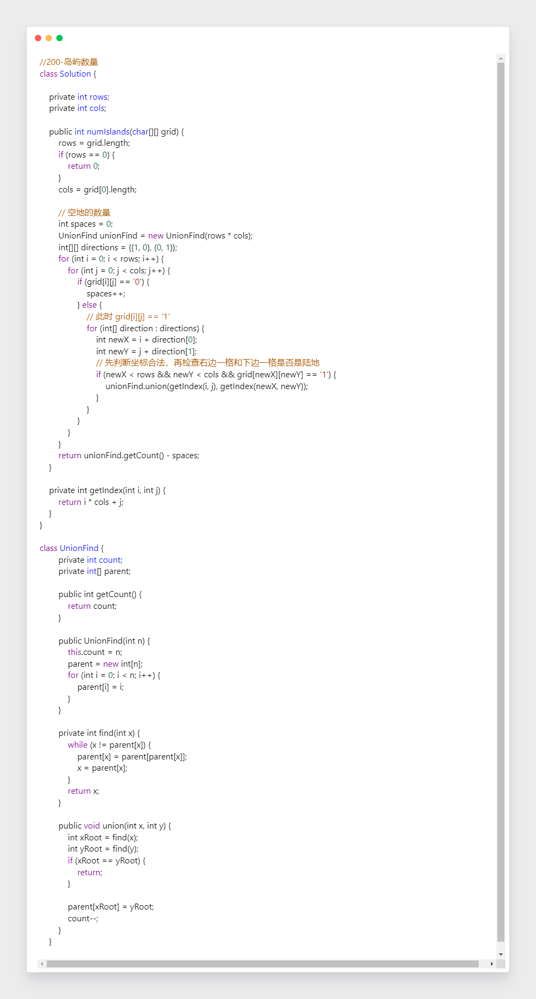

   ​	【3】被围绕的区域

    	（1）思路

   ​		把四周的 O 都和一个虚拟结点合并起来；	

   ​		在内部，只看右、下两个方向，把 O 都合并起来；

   ​		最后一遍扫描，不和「虚拟结点」连接的 O 都标记成 X

    	（2）代码

   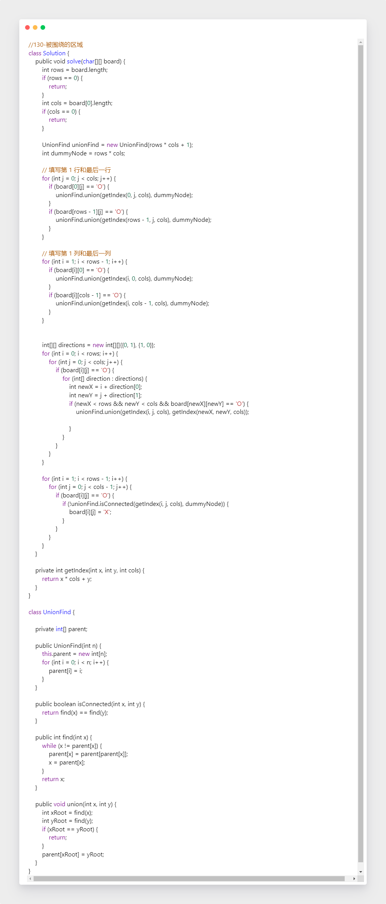

   

三、高级搜索

1. 理论学习

    回顾朴素搜索、DFS、BFS

   优化方式：不重复、剪枝

   【1】双向BFS：当起点和终点都确定，两边同时开始搜索，直到出现交集

   【2】启发式搜索A*：使用优先队列

2. 实战题目

    【1】有效的数独

    （1）思路

   ​		将大矩阵分割成9个3x3的小块，检查每个小格的值是否在行、列、小块内重复出现

    （2）代码

   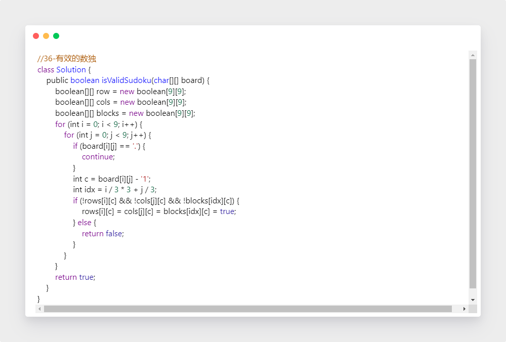

    【2】解数独

   ​	（1）思路

   ​			遇到空格，试着填一个数字，继续下探，如成功则成功

   ​			失败则回溯

   ​	（2）代码

   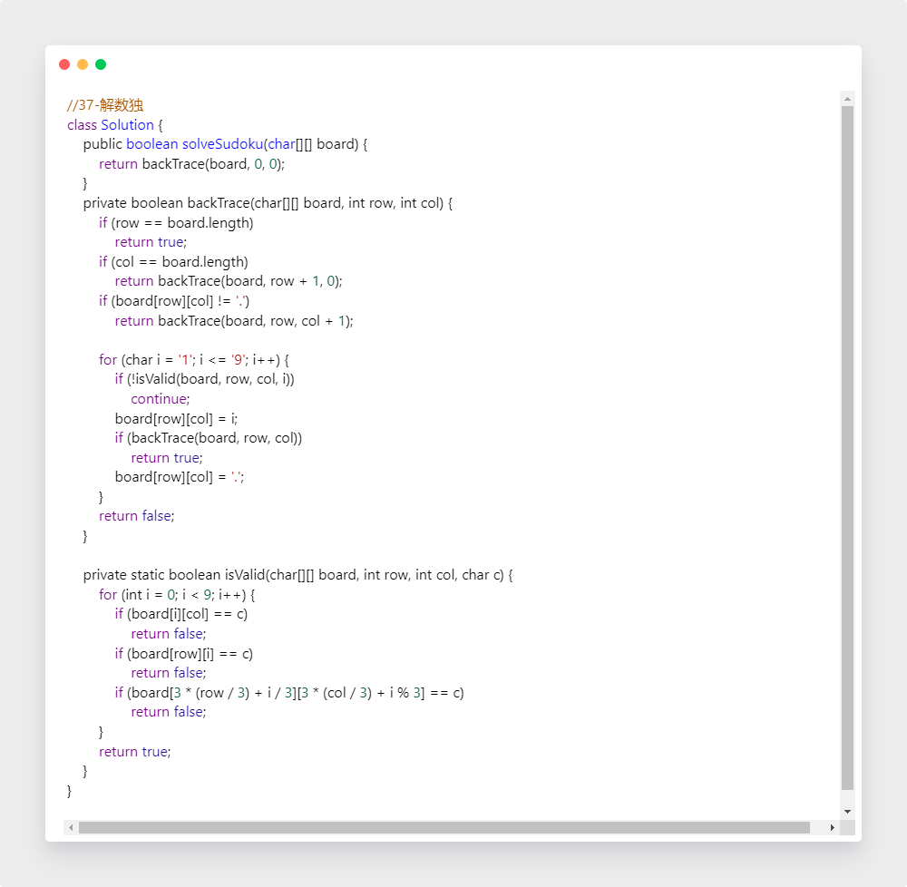

   双向BFS和启发式搜索A* 还没太懂，留个坑，再来填

   

四、红黑树和AVL树

1. 理论学习

   ​	回顾树、二叉树、二叉搜索树

    	  二叉搜索树的极端情况，所有结点都在一侧（极端情况下，就相当于一维链表）

   ​		所以，保持性能的关键，要保证二维的维度，即要左右子树的结点平衡

     【1】平衡二叉树：本身有很多种实现，常用的有2-3树、AVL树、B树、红黑树，treap和splay也要了解

     【2】平衡因子：右子树高度 - 左子树高度（有时相反，即为左子树高度 - 右子树高度）

   ​	balance factor = {-1, 0, 1}

     【3】AVL树的旋转操作 （带有子树的情况）

    	①左左子树 ==> 右旋

   ​	 ②右右子树 ==> 左旋

   ​	 ③左右子树 ==> 左右旋

   ​	 ④右左子树 ==> 右左旋

   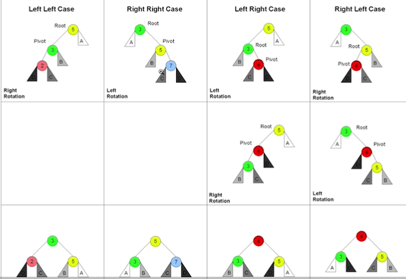

   【AVL树缺点】结点需要存储额外信息，且调整变动频繁

   【5】红黑树性质

   ​	任何一个结点的左右子树的高度差小于两倍

   ​	①每个结点要么是红色，要么是黑色

   ​	②根结点是黑色

   ​	③每个叶结点（NIL结点、空结点）是黑色

   ​	④不能有相邻接的两个红色结点

   ​	⑤从任意结点到其每个叶子的所有路径都包含相同数目的黑色结点

   【AVL树与红黑树比较】

   | AVL        | 红黑树     |
   | ---------- | ---------- |
   | 查找快     | 插入删除快 |
   | 空间开销大 | 空间开销小 |

五、位运算

1. 理论学习

   【1】位运算符

   | 运算符 | 含义     |
   | ------ | -------- |
   | <<     | 左移     |
   | >>     | 右移     |
   | \|     | 按位或   |
   | &      | 按位与   |
   | ~      | 按位取反 |
   | ^      | 按位异或 |

   【2】异或的进阶操作

   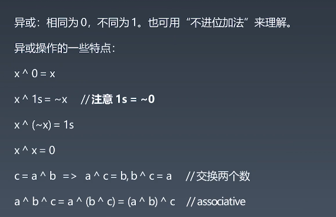

   【3】指定位置的位运算

   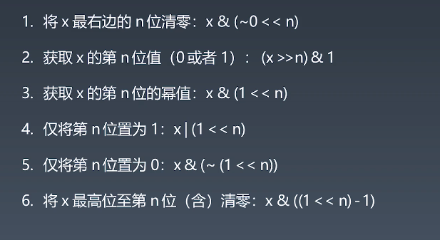

   【4】位运算实战技巧

   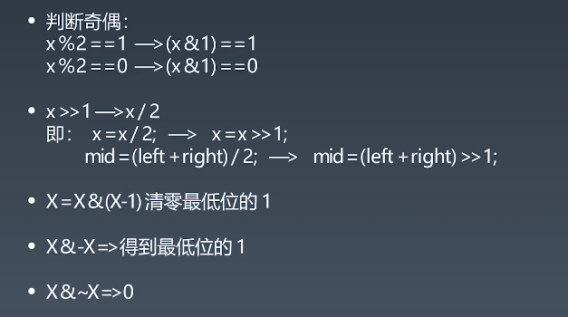

2. 实战题目

   【1】位1的个数

    （1）思路

   ​	依次清除最低位的1，计数

    （2）代码

   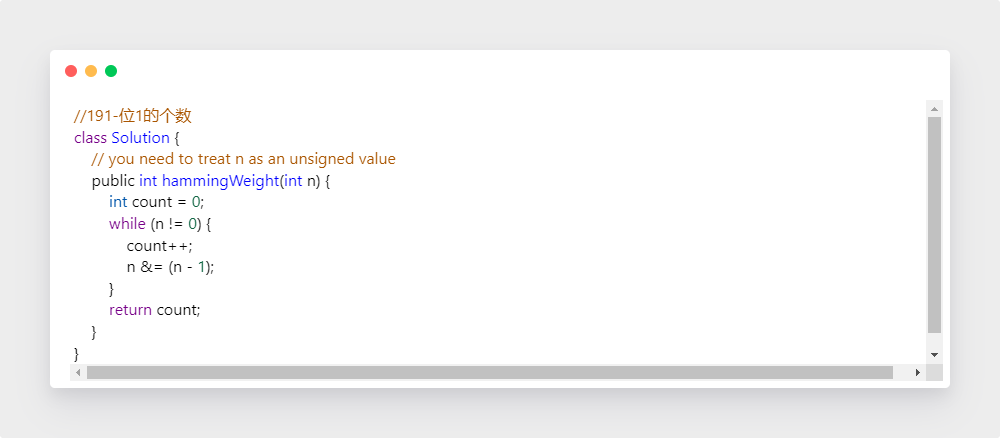

   【2】2的幂

    （1）思路

   ​	如果该数是2的整数次幂，那么它的二进制表示中只能有1位是1，把那一位清除后，就是0

    （2）代码

   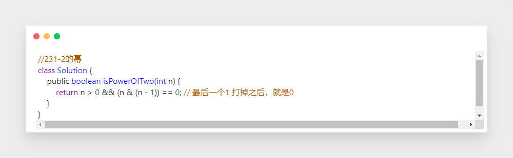

   【3】颠倒二进制位

    （1）思路

   ​	将第i位和第31-i位颠倒

    （2）代码

   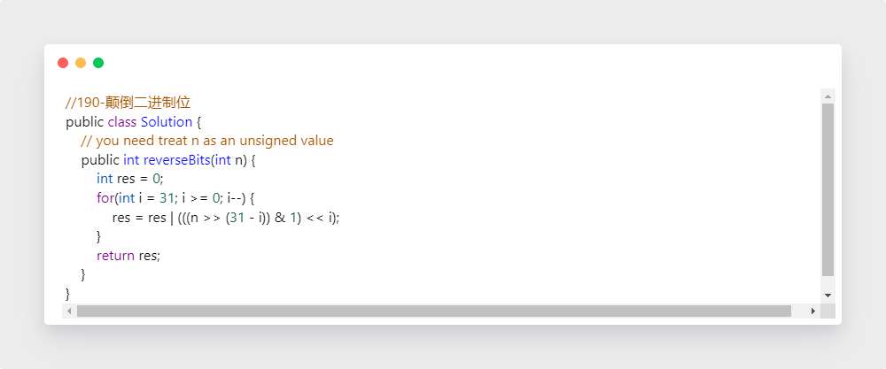

   【4】n皇后

    （1）思路

   ​		(cols|pie|na) 所有不能放的位置0  取反 ~(cols|pie|na) 所有能放的位置1

   ​		放置过程  放在最后一个位置，bits&(bits-1) 把最后一位是1的打掉 0表示不能放

    （2）代码

   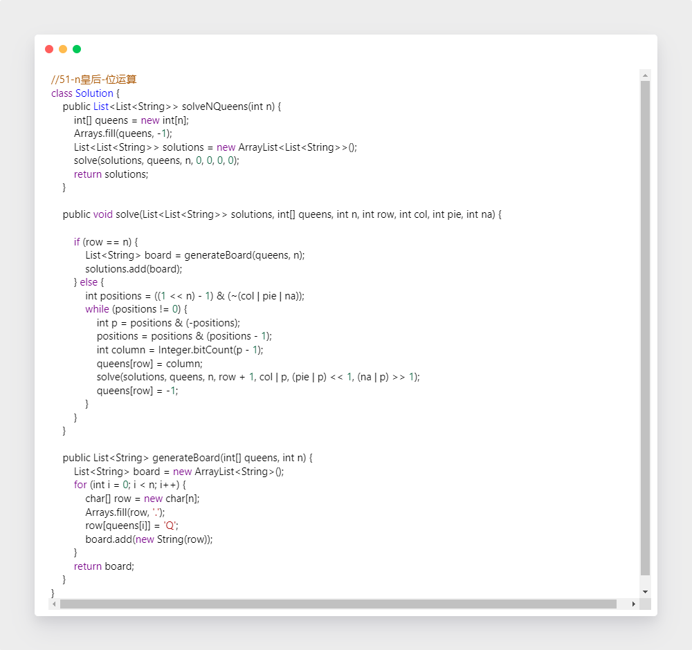

   【5】比特二进制计数

    （1）思路

   ​	 	位运算 & 动态规划

   ​		偶数 可以由前面某个数左移得到， 1的个数不变

   ​		dp[i]=dp[i/2]

   ​		e.g. 2 -> 10  4 -> 100

   ​		奇数 可以由前面某个数左移，再加一得到，1的个数+1

   ​		dp[i] = dp[i-k]+1  k 就是不大于n的2的整数次幂中的最大值

   ​		e.g. 3 -> 11  7 -> 111

    （2）代码

   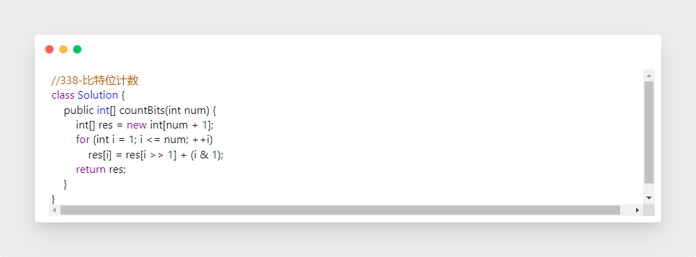