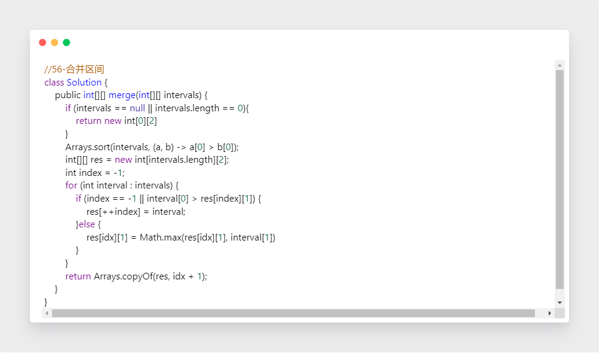

学习笔记

一、布隆过滤器

1. 理论学习

   （1）组成：一个二进制向量和一系列随机映射函数

   （2）特点：在的不一定在，不在的一定不在

   

   

   （3）使用场景：只需要判定一个元素是否存在，一般只在最外围缓存应用，可能存在后再继续查询数据库

   （4）布隆过滤器 vs 哈希表

   | 哈希表     | 布隆过滤器               |
   | :--------- | ------------------------ |
   | 完全无差错 | 有一定误识别率，删除困难 |
   | 空间开销大 | 节省空间                 |

   （5）工程应用：①比特币网络②分布式系统 （Map-Reduce） Hadoop 搜索引擎③Redis缓存④垃圾邮件、评论等的过滤

   

二、LRU Cache

1. 理论学习

   （1）两个要素：大小、替换策略

   （2）实现：哈希表 + 双向链表 （Java === LinkedHashMap）

   （3）特点：查询、修改都是O(1)的

2. 实战题目

   【1】LRU缓存机制

   （1）思路

   ​	①借助LinkedHashMap，重写缓存策略，调用super方法

   ​	②手动实现哈希表和双向链表

   ​		定义如下双向链表：

   

   ​	构造方法：初始化当前存储数量size和存储容量上限capacity，以及头尾指针

   

   ​	get方法：首先判断 key 是否存在，如果 key 不存在，则返回 -1;  如果 key 存在，则 key 对应的节点是最近被使用的节点。移动双向链表的指针获取到该值返回

   

   ​	put方法：首先判断 key 是否存在，如果 key 不存在，使用 key 和 value 创建一个新的节点，在双向链表的头部添加该节点，并将 key 和该节点添加进哈希表中。然后判断双向链表的节点数是否超出容量，如果超出容量，则删除双向链表的尾部节点，并删除哈希表中对应的项；
   ​      如果 key 存在，则与 get 操作类似，先通过哈希表定位，再将对应的节点的值更新为 value，并将该节点移到双向链表的头部

   

   （2）代码

   

   

三、排序算法

1. 理论学习

   （1）排序算法的分类

   

   （2）各种排序的时间复杂度

   

   （3）排序思想简述

   ​	【1】选择排序：每次找最小值，然后放在待排序数组的起始位置

   ​	【2】插入排序：从前到后逐步构建有序序列；对于未排序数据，在已排序序列中从后向前扫描，找到相应位置插入

   ​	【3】冒泡排序：每次查看相邻的元素，如果逆序，则交换。相当于每次找出最大值，放在最后的合适位置

   ​	【4】快速排序：分治，数组取标杆pivot，将小元素放在左边，大元素放在右边，然后依次对左边和右边的子数组继续快排，以达到整个序列有序

   ​	【5】归并排序：分治，和快排的操作顺序相反。把长度为n的输入序列分成两个长度为n/2的子序列，对这两个子序列分别采用归并排序，将两个排序好的子序列合并成一个最终的排序序列

   ​	【6】堆排序：堆插入，取最大/小值。数组元素依次建立小顶堆，依次取堆顶元素并删除

   ​	以下特殊排序往往对数据有要求，例如只能是整数

   ​	【7】计数排序：计数排序要求输入的数据必须是有确定范围的整数。将输入的数据值转化为键存储在额外开辟的数组空间中；然后依次把计数大于1的填充回原数组

   ​	【8】桶排序：假设输入数据服从均匀分布，将数据分到有限数量的桶里，每个桶再分别排序（有可能使用别的排序算法或是以递归方式继续使用桶排序）

   ​	【9】基数排序：基数排序是按照低位先排序，然后收集；再按照高位排序，然后再收集；以此类推，直到最高位。有时候有些属性是有优先级顺序的，先按低优先级排序，再按高优先级排序

2. 实战题目

   【1】有效的字母异位词

   ​	（1）思路 

   ​				计数排序，看最后统计的排序结果是否相同

   ​	（2）代码

   

   【2】数组的相对排序

   ​	（1）思路 

   ​		先将arr1中的数全都记录到数组count中，然后遍历arr2的同时，将arr2中的数置入arr1，

   ​	（2）代码

   

   【3】合并区间

   ​	（1）思路 

   ​			按照区间左端点排序，比较区间的右端点，进行合并，或者开辟新的区间

   ​	（2）代码

   

   【4】翻转对

   ​	（1）思路 
   ​			归并排序，假设对于数组[i...j]，我们已经分别求出了子数组[i...mid]和[mid+1...j]的翻转对数目，并已将两个子数组分别排好序，则数组[i...j]中的翻转对数目，就等于两个子数组的翻转对数目之和，加上左右端点分别位于两个子数组的翻转对数目

   ​	（2）代码

   

四、高级动态规划

1. 理论学习

   ​	（1）回顾递归、分治，动态规划=分治+最优子结构

   ​	（2）高级动态规划的复杂度来源：状态拥有更多维度，状态方程更加复杂

2. 实战题目

   ​	【1】使用最小花费爬楼梯

   ​		（1）思路 

   ​				爬楼梯问题系列一定要写熟练！！！

   ​				dp[i] 表示达到下标 i 的最小花费

   ​				初始化：选择下标 0 或 1 作为初始阶梯 dp[0]=dp[1]=0

   ​				两种走法：从 i-1 上来 ==> cost[i−1]，从 i−2 上来 ==> cost[i−2]

   ​				DP方程：*dp*[*i*]=min(*dp*[*i*−1]+*cost*[*i*−1],*dp*[*i*−2]+*cost*[*i*−2])

   ​		（2）代码

   

   ​		可以进行空间优化，代码不再贴出来了

   ​	【2】编辑距离

   ​		（1）思路 

   ​			状态增加一个维度，一个维度表示一个字符串

   ​	 		dp[i] [j] 代表 word1 到 i 位置转换成 word2 到 j 位置需要最少步数

   ​			当 word1[i] == word2[j]，*dp[i] [j] = dp[i-1] [j-1]；*
   ​			当 word1[i] != word2[j]，*dp[i] [j] = min(dp[i-1] [j-1], dp[i-1] [j], dp[i] [j-1]) + 1*

   ​		（2）代码

   

五、字符串匹配算法

1. 理论学习

   （1）字符串可变与不可变：Java Python Go 不可变字符串，是线程安全的；C++ 可变字符串，加const后不可变

   （2）字符串的遍历与比较，一般使用equals() 

   （3）字符串匹配算法在枚举起点上无法优化，与暴力法一致；而比较过程可以优化

   ​		①Rabin-Karp算法：利用子串的hash值加速对比

   

   ​		②KMP算法：以匹配部分的最大前缀和最大后缀，调整下一次的位置，移动合适的距离

   

2. 实战题目

   ​	【1】字符串中的第一个唯一字符

   ​		（1）思路 

   ​				两次遍历，在第一次遍历时，统计出字符串中每个字符出现的次数。在第二次遍历时，只要遍历		到了一个只出现一次的字符，那么就返回它的索引，否则在遍历结束后返回 -1

   ​		（2）代码

   

   ​    【2】字符串转换整数atoi

   ​		（1）思路 

   ​				常规处理，注意特定条件，考虑符号和越界问题，最后才进行转换

   ​				正则表达式、有限自动机也可以解决这个问题

   ​		（2）代码

   

   ​	【3】最长公共前缀

   ​		（1）思路 

   ​					对齐，按列扫描，如果与参照的字符相同，则继续；否则，不再比较，之前一个公共前缀即为				所求

   ​		（2）代码

   

   ​	【4】反转字符串

   ​		（1）思路 

   ​				双指针，i++ ，j--

   ​		（2）代码

   

   ​	【5】最长回文子串

   ​		（1）思路 

   ​				子串是连续的；而子序列不一定是连续的，保持相对顺序即可

   ​				 dp[i] [j]  s[i...j] 是否是回文串 true / false  长度不足2时 j-i = 0,1 皆为回文串

   ​				*dp[i] [j] = dp[i+1] [j-1] && s[i]==s[j]*

   ​		（2）代码

   

   ​	【7】正则表达式匹配

   ​		（1）思路 

   

   ​		（2）代码

   

小作业—不同路径II的DP方程

dp[i] [j] 表示到(i,j) 的路径数

